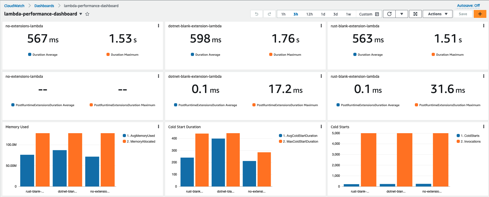
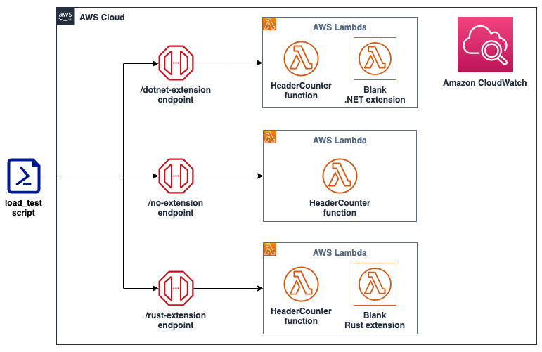
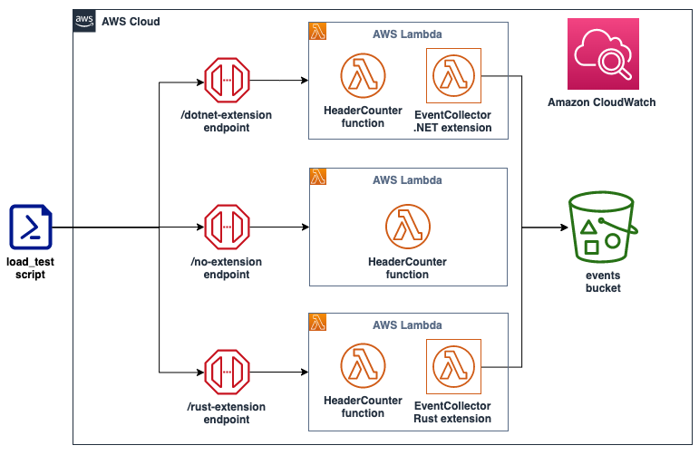
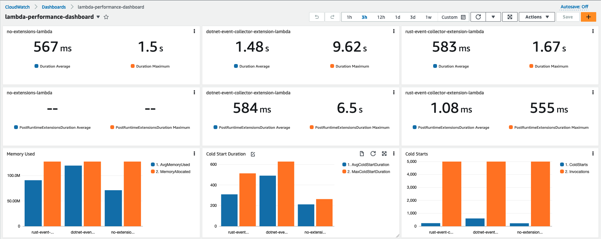
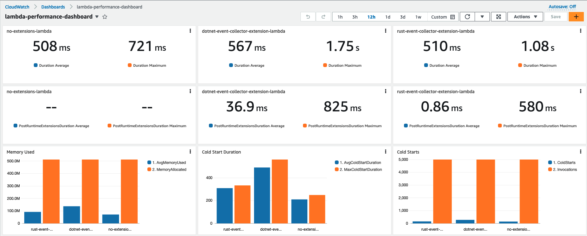
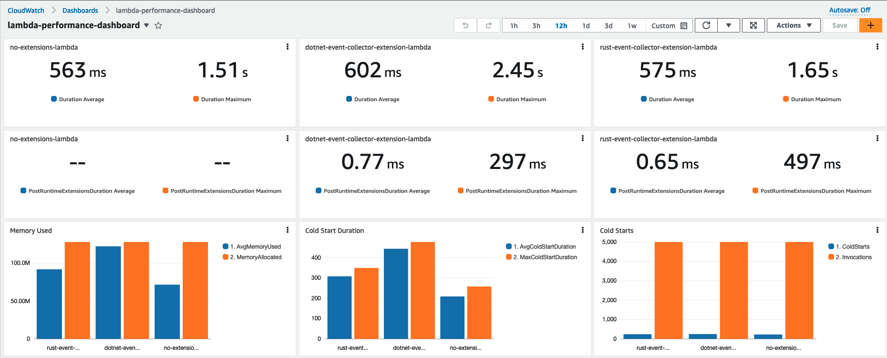

# Optimizing AWS Lambda extensions in C# and Rust

Customers use [AWS Lambda extensions](https://docs.aws.amazon.com/lambda/latest/dg/lambda-extensions.html) to integrate monitoring, observability, security, and governance tools with their Lambda functions. AWS, along with [AWS Lambda Ready Partners](https://aws.amazon.com/lambda/partners), like [Datadog](https://www.datadoghq.com/product/serverless-monitoring/), [Dynatrace](https://www.dynatrace.com/technologies/aws-monitoring/), [New Relic](https://newrelic.com/platform/serverless-aws-lambda), provides ready-to-run extensions. You can also develop your own extensions to address your specific needs.

External Lambda extensions are designed as a companion process running in the same execution environment as the function code. That means that the Lambda function shares resources like memory, CPU, and disk I/O, with the extension. Improperly designed extensions can result in a performance degradation and extra costs.

This post shows how to measure the impact an extension has on the function performance using key performance metrics on an [Amazon CloudWatch](https://docs.aws.amazon.com/AmazonCloudWatch/latest/monitoring/WhatIsCloudWatch.html) dashboard.

This post focuses on Lambda extensions written in [C#](https://en.wikipedia.org/wiki/C_Sharp_(programming_language)) and [Rust](https://en.wikipedia.org/wiki/Rust_(programming_language)). It shows the benefits of choosing to write Lambda extensions in Rust. Also, it explains how you can optimize a Lambda extension written in C# to deliver three times better performance. The solution can be converted to the programming languages of your choice.

## Overview

A C# Lambda function (running on .NET 6) called [HeaderCounter](./src/dotnet/Corp.Demo.Functions.HeaderCounter/Function.cs) is used as a baseline. The function counts the number of headers in a request and returns the number in the response. A static delay of 500 ms is inserted in the function code to simulate extra computation. The function has the minimum memory setting (128 MB), which magnifies the impact that extension has on performance.

A load test is performed via a [curl command](./scripts/load-test.sh) that is issuing `5000` requests (with `250` requests running simultaneously) against a public [Amazon API Gateway](https://aws.amazon.com/api-gateway/) endpoint backed by the Lambda function. A CloudWatch [dashboard](./app/lib/constructs/lambda-perf-dashboard.ts), named *lambda-performance-dashboard*, displays performance metrics for the function.

Metrics captured by the dashboard:

1. The *Max Duration*, and *Average Duration* metrics allow you to assess the impact the extension has on the function execution duration.
1. The *PostRuntimeExtensionsDuration* metric measures the extra time that the extension takes after the function invocation.
1. The *Average Memory Used*, and *Memory Allocated* metrics allow you to assess the impact the extension has on the function memory consumption.
1. The *Cold Start Duration*, and *Cold Starts* metrics allow you to assess the impact the extension has on the function cold start.

## Running the extensions

There are a few differences between how the extensions written in C# and Rust are run.

The extension written in Rust is published as an executable. The advantage of an executable is that it is compiled to native code, and is ready to run. The extension is environment agnostic, so it can run alongside with a Lambda function written in another runtime.

The disadvantage of an executable is the size. Extensions are served as [Lambda layers](https://docs.aws.amazon.com/lambda/latest/dg/configuration-layers.html), and the size of the extension counts towards the deployment package size. The maximum unzipped deployment package size for Lambda is 250 MB.

The extension written in C# is published as a dynamic-link library (DLL). The DLL contains the [Common Intermediate Language](https://en.wikipedia.org/wiki/Common_Intermediate_Language) (CIL), that must be converted to native code via a just-in-time (JIT) compiler. The .NET runtime must be present for the extension to run. The `dotnet` command runs the DLL in the [example provided](./src/dotnet/Corp.Demo.Extensions.Blank/extensions/corp-demo-extensions-blank) with the solution.

## Blank extension

Three instances of the HeaderCounter function are deployed:

1. The first instance, available via a *no-extension* endpoint, has no extensions.
1. The second instance, available via a *dotnet-extension* endpoint, is instrumented with a [blank extension](./src/dotnet/Corp.Demo.Extensions.Blank/Program.cs) written in C#. The extension does not provide any extra functionality, except logging the event received to CloudWatch.
1. The third instance, available via a *rust-extension* endpoint, is instrumented with a [blank extension](./src/rust/corp-demo-extensions-blank/src/main.rs) written in Rust. The extension does not provide any extra functionality, except logging the event received to CloudWatch.

The dashboard shows that the extensions add minimal overhead to the Lambda function. The extension written in C# adds more overhead in the higher percentile metrics, such as the *Maximum Cold Start Duration* and *Maximum Duration*.

## EventCollector extension

Three instances of the HeaderCounter function are deployed:

1. The first instance, available via a *no-extension* endpoint, has no extensions.
1. The second instance, available via a *dotnet-extension* endpoint, is instrumented with an [EventCollector extension](./src/dotnet/Corp.Demo.Extensions.EventCollector/Program.cs) written in C#. The extension is pushing all the extension invocation events to [Amazon S3](https://aws.amazon.com/s3/).
1. The third instance, available via a *rust-extension* endpoint, is instrumented with an [EventCollector extension](./src/rust/corp-demo-extensions-event-collector/src/main.rs) written in Rust. The extension is pushing all the extension invocation events to S3.

The Rust extension adds little overhead in terms of the *Duration*, number of *Cold Starts*, and *Average PostRuntimeExtensionDuration* metrics. Yet there is a clear performance degradation for the function that is instrumented with an extension written in C#.

*Average Duration* jumped almost **three times**, and the *Maximum Duration* is now around **six times** higher.

The function is now consuming almost all the memory allocated. CPU, networking, and storage for Lambda functions are allocated based on the amount of memory selected. Currently, the memory is set to 128 MB, the lowest setting possible. Constrained resources influence the performance of the function.

Increasing the memory to 512 MB and re-running the load test improves the performance. *Maximum Duration* is now 721 ms (including the static 500 ms delay).

For the C# function, the *Average Duration* is now only 59 ms longer than the baseline. The *Average PostRuntimeExtensionDuration* is at 36.9 ms (compared with 584 ms previously). This performance gain is due to the memory increase without any code changes.

You can also use the [Lambda Power Tuning](https://docs.aws.amazon.com/lambda/latest/operatorguide/profile-functions.html) to determine the optimal memory setting for a Lambda function.

## Garbage collection

Unlike C#, Rust is not a garbage collected language. [Garbage collection](https://en.wikipedia.org/wiki/Garbage_collection_(computer_science)) (GC) is a process of managing the allocation and release of memory for an application. This process can be resource intensive, and can affect higher percentile metrics. The impact of GC is visible with the blank extension’s and EventCollector extension’s metrics.

Rust uses [ownership](https://doc.rust-lang.org/book/ch04-00-understanding-ownership.html) and [borrowing](https://doc.rust-lang.org/book/ch04-02-references-and-borrowing.html) features, allowing for safe memory release without relying on GC. This makes Rust a good runtime choice for tools like Lambda extensions.

## EventCollector native AOT extension

Native ahead-of-time (Native AOT) compilation (available in .NET 7 and .NET 8), allows for the extensions written in C# to be delivered as executables, similar to the extensions written in Rust.

Native AOT does not use a JIT compiler. The application is compiled into a self-contained (all the resources that it needs are encapsulated) executable. The executable runs in the target environment (for example, Linux x64) that is specified at compilation time.

These are the results of compiling the .NET extension using Native AOT and re-running the performance test (with function memory set to 128 MB):

For the C# extension, *Average Duration* is now close the baseline (compared to three times the baseline as a DLL). *Average PostRuntimeExtensionDuration* is now 0.77 ms (compared with 584 ms as a DLL). The C# extension also outperforms the Rust extension for the *Maximum PostRuntimeExtensionDuration* metric – 297 ms versus 497 ms.

Overall, the Rust extension still has better *Average/Maximum Duration*, *Average/Maximum Cold Start Duration*, and *Memory Consumption*. The Lambda function with the C# extension still uses almost all the allocated memory.

Another metric to consider is the binary size. The Rust extension compiles into a 12.3 MB binary, while the C# extension compiles into a 36.4 MB binary.

## Example walkthroughs

To follow the example walkthrough, visit the [README](README.md). The walkthrough explains:

1. The prerequisites required.
1. A detailed solution deployment walkthrough.
1. The cleanup process.
1. Cost considerations.

## Conclusion

This post demonstrates techniques that can be used for running and profiling different types of Lambda extensions. This post focuses on Lambda extensions written in [C#](https://en.wikipedia.org/wiki/C_Sharp_(programming_language)) and [Rust](https://en.wikipedia.org/wiki/Rust_(programming_language)). This post outlines the benefits of writing Lambda extensions in Rust and shows the techniques that can be used to improve Lambda extension written in C# to deliver better performance.

Start writing Lambda extensions with Rust by using the [Runtime extensions for AWS Lambda](https://crates.io/crates/lambda-extension) crate. This is a part of a [Rust runtime for AWS Lambda](https://github.com/awslabs/aws-lambda-rust-runtime).

For more serverless learning resources, visit [Serverless Land](https://serverlessland.com/).
